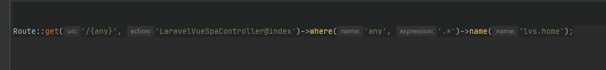
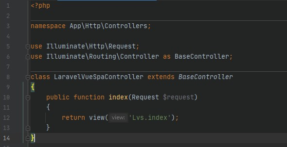
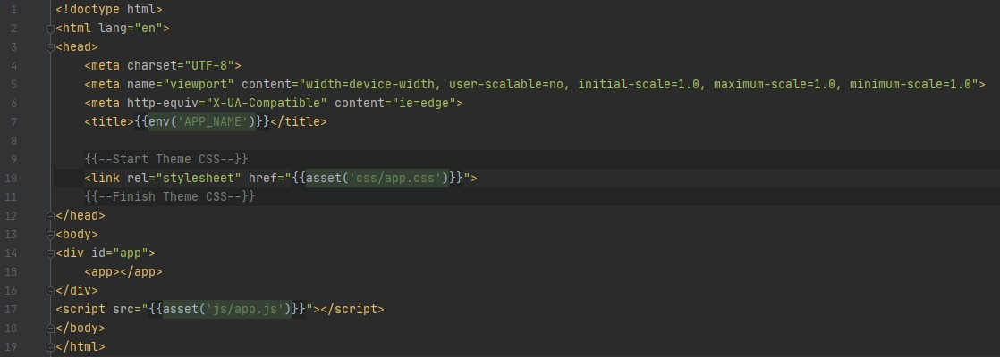

# Laravel Vue SPA

Laravel Vue SPA  - A php library to setup a Laravel Vue SPA project environment by couple of small commands

## Installation

Run This commands inside a Fresh or existing Laravel project

```bash
composer require rdhafiz/laravel-vue-spa
```
```bash
php artisan LaravelVueSpa
```
```bash
npm install && npm install vue vue-router vuex axios vue-page-transition -save
```
```bash
npm run watch
php artisan serve
```

The package will automatically register its service provider.

## Configurations

```routes/web.php```



```Http/Controllers/LaravelVueSpaController.php```



```resources/views/Lvs/index.blade.php```



### Vue Development Configuration Folder Structure
    .
    ├── ...
    ├── js                    ### Vue Development Folder
    │   ├── Pages             # Folder where all vue pages are stored
    │   │   ├── About.vue     # Demo About us page
    │   │   ├── Contact.vue   # Demo Contact us page
    │   │   ├── Home.vue      # Demo Home page
    │   ├── Router            ### Vue Route Folder
    │   │   ├── router.js     # All Vue Routes are here
    │   ├── Store             ### Vuex Manager Folder
    │   │   ├── store.js      # Vues file to manage vuex data
    │   ├── app.js            ### Vue configure File
    │   ├── App.vue           # Root Vue Template      
    └── ...


## License

Released under the MIT License, see [LICENSE](LICENSE).
